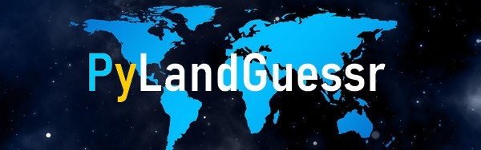
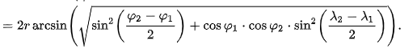

# PyLandGuessr
- PylandGuessr is a programm that allows you to guess country with an image like the game GeoGuessr.

# Requirement
- pygame
- geopy
- numpy
- open-cv

# How to play
- Once lauched, an image is randomly selected
- A window with the world map appears
- You have to click on the country where you think the image belongs
  - If you guess the right country you win.
  - If you don't guess but still have some attempts left, the program shows you the distance and direction to which the country is located 
  - If you don't guess and you have no more attempts left, you have lost.
  
# How it works
- The window size is 1200*600
- The mouse position is converted to X and Y in this window
- Position X = 0 and Y = 0 is equivalent to longitude = 0 and latitude = 0

- X and Y are converted into Lon and Lat using coefficients calculated by me (the precision is not perfect, see excel)

- The name of the image (country) is stored in the program
- The program keeps the geolocation of the country of the image for when the player makes a wrong prediction
- The geolocation proposed by the player is converted into a country if it corresponds to one of them
  -  If the country proposed is the same as the one in the image, then it's a winner
  -  If the proposed country is not the same and if there are any attempts left, then the program calculates the distance between the proposed country and the searched one (Haversine Formula : determine distance between 2 points on a sphere using Lat and Lon) and adds the direction (cardinal point) where it is located. 

# Problems with the game/idea for improvement
- At first I wanted to use an interactive map where you can zoom in. I didn't find in python what I was looking for. It would be ideal to improve the game.
- Continuous games without having to restart the game between each image.
- A point/best score system

# Images of the game

- Image game launched

- Image game wrong guess

- Image game Nothing found

- Image game good guess

